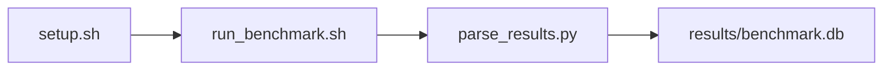

# STREAM - CPU (Copy/Scale/Add/Triad) Benchmark

[](LICENSE)
[](https://github.com/garys-gpu-benchmarks/207-sys-bench-nvidia-stream-ddr5-bandwidth-ubu2404/actions/workflows/ci.yml)

Target: Ubuntu 24.04 · NVIDIA · see Hardware Requirements. This is a host benchmark, not a laptop `pip install` project.

## Quick Start

```bash
git clone https://github.com/garys-gpu-benchmarks/207-sys-bench-nvidia-stream-ddr5-bandwidth-ubu2404.git
cd 207-sys-bench-nvidia-stream-ddr5-bandwidth-ubu2404
sudo bash setup.sh --assume-yes
bash run_benchmark.sh --profile smoke --validate
```
Results are written to `results/benchmark.db` and `results/summary.json`.

This workload is executed on the validation host after the repository is copied there. `setup.sh` and `run_benchmark.sh` do not open an outbound SSH session.

Prerequisites: Ubuntu 24.04; NVIDIA; Python 3.12.3; root or sudo for `setup.sh`. Framework: Bash, SQLite, Python, PyYAML, C (not C++), GCC, OpenMP. This is a host benchmark, not a laptop `pip install` project.



## 1. Overview

Compiles official STREAM src/stream.c with gcc -O3 -fopenmp into build/stream (copied to bin/stream) and runs Copy/Scale/Add/Triad. array_size: STREAM_ARRAY_SIZE. num_iterations: STREAM NTIMES. num_threads: OMP_NUM_THREADS. Sweep dimensions: numa_node, num_threads, thread_affinity, page_size, dtype, array_size, kernel_types, num_iterations.

## 2. What It Validates

- Validates that STREAM Copy/Scale/Add/Triad rates parse and the derived efficiency metric is finite
- #1: Best Copy bandwidth, GB/s (copy_bandwidth_gb_s); is present and physically sensible.
- #2: Best Scale bandwidth, GB/s (scale_bandwidth_gb_s); is present and physically sensible.
- #3: Best Add bandwidth, GB/s (add_bandwidth_gb_s); is present and physically sensible.
- #4: Best Triad bandwidth, GB/s (triad_bandwidth_gb_s) is present and physically sensible.

## 3. Metrics Captured

- **#1: Best Copy bandwidth, GB/s** — stored as `copy_bandwidth_gb_s`.
- **#2: Best Scale bandwidth, GB/s** — stored as `scale_bandwidth_gb_s`.
- **#3: Best Add bandwidth, GB/s** — stored as `add_bandwidth_gb_s`.
- **#4: Best Triad bandwidth, GB/s** — stored as `triad_bandwidth_gb_s`.

## 4. Hardware Requirements

### Supported environment

- OS: Ubuntu 24.04
- GPU vendor: NVIDIA
- Framework family: Bash, SQLite, Python, PyYAML, C (not C++), GCC, OpenMP
- Python: Python 3.12.3

### Reference validation environment

The tables below describe the machine used to generate the reference results. They are not a requirement that every user buy that exact cloud instance.

### System

Compiles official STREAM src/stream.c with gcc -O3 -fopenmp into build/stream (copied to bin/stream) and runs Copy/Scale/Add/Triad. array_size: STREAM_ARRAY_SIZE. num_iterations: STREAM NTIMES.

### GPU

Ubuntu 24.04 / NVIDIA / Bash, SQLite, Python, PyYAML, C (not C++), GCC, OpenMP

## 5. Software Requirements

| Component | Version |
|---|---|
| OS | Ubuntu 24.04 |
| Kernel | kernel 6.8.0 |
| Python | Python 3.12.3 |
| ROCm | CUDA 12.8 |
| rocBLAS | N/A - rocBLAS not used |

Compiles official STREAM src/stream.c with gcc -O3 -fopenmp into build/stream (copied to bin/stream) and runs Copy/Scale/Add/Triad. array_size: STREAM_ARRAY_SIZE. num_iterations: STREAM NTIMES.

## 6. Installation

```bash
Compile stream.c with gcc -O3 -fopenmp; run build/stream with OMP_NUM_THREADS; parse STREAM stdout. Does not use numactl
```

## 7. Running the Benchmark

```bash
Compile stream.c with gcc -O3 -fopenmp; run build/stream with OMP_NUM_THREADS; parse STREAM stdout. Does not use numactl
```

**Validating results separately:**

```bash
export BENCHMARK_PYTHON=/usr/bin/python3.13  # optional
python3 -m venv .venv
source ".venv/bin/activate"
".venv/bin/python" scripts/validate_results.py
```

## 8. Output

### `results/benchmark.db` (SQLite)

STREAM stdout plus one CSV aggregate. The binary is also copied to bin/stream. A single row is duplicated to two samples

sample_index,status,copy_bandwidth_gb_s,scale_bandwidth_gb_s,add_bandwidth_gb_s,triad_bandwidth_gb_s,error_message
0,ok,180,175,190,185,

```bash
Compile stream.c with gcc -O3 -fopenmp; run build/stream with OMP_NUM_THREADS; parse STREAM stdout. Does not use numactl
```

### `results/summary.json`

Consolidated metrics from the most recent run — suitable for CI artifact upload or dashboard ingestion.

### `results/raw/<timestamp>.txt`

STREAM stdout plus one CSV aggregate. The binary is also copied to bin/stream. A single row is duplicated to two samples

sample_index,status,copy_bandwidth_gb_s,scale_bandwidth_gb_s,add_bandwidth_gb_s,triad_bandwidth_gb_s,error_message
0,ok,180,175,190,185,

## 9. Baselines / Thresholds

Expected ranges and gates live in `config/benchmark_config.yaml` under `baselines:` or `thresholds:`. To update them, edit that file — never edit validation code directly.

## 10. Troubleshooting

**`setup.sh` missing collector**
Create cannot finish without `scripts/collect_workload.py`.

**`self_check` overlay rewritten**
Do not overwrite files listed in `results/overlay_lock.json`.

**Remote SSH drop during setup**
Reconnect and resume `bash setup.sh --assume-yes`. Do not wipe `.venv` or `.cache`.

## 11. NVIDIA H100 Coding Differences

Native NVIDIA CUDA workload. Execute on the stated Ubuntu release with the host NVIDIA driver and CUDA userspace. ROCm porting notes do not apply.

## Repository layout

```text
.
├── setup.sh
├── run_benchmark.sh
├── benchmark_specification.json
├── .github/workflows/      # thin CI callers (see Continuous Integration)
├── config/
├── scripts/
├── src/
├── tests/
├── docs/
├── results/
└── LICENSE
```

## Continuous Integration

| Workflow | Runs on | When | What it does |
|---|---|---|---|
| [CI](.github/workflows/ci.yml) | GitHub-hosted runner | every pull request, and every push to `main` | shellcheck, ruff, `bash -n`, `compileall`, `run_benchmark.sh --help`, specification schema, the results validator on a seeded fixture, required files, and actionlint. No GPU and no benchmark run. |
| [GPU Smoke Benchmark](.github/workflows/gpu-smoke.yml) | self-hosted runner labeled `gpu`, `nvidia`, `ubu2404` | only when started by hand: **Actions → GPU Smoke Benchmark → Run workflow** (choose `smoke`, `baseline` or `extended`) | Verifies the pre-provisioned GPU stack, records `results/environment.json` (driver, runtime, kernel, GPU), runs the profile with `--validate`, shows headline metrics on the run page, and uploads the results. |

Both files are short callers. The steps themselves live once, for every workload in the suite, in [`garys-gpu-benchmarks/shared-workflows`](https://github.com/garys-gpu-benchmarks/shared-workflows), pinned at `@v1`. The GPU workflow is never triggered by pull requests, so code from a fork cannot run on the GPU host.

### Running it as part of the NVIDIA Ubuntu 24.04 bundle

This repository is one of the 32 workloads in [`bundle-nvidia-ubuntu-2404`](https://github.com/garys-gpu-benchmarks/bundle-nvidia-ubuntu-2404), which holds them as git submodules. To put the whole bundle on a GPU host and run this workload from it:

```bash
git clone --recurse-submodules https://github.com/garys-gpu-benchmarks/bundle-nvidia-ubuntu-2404 /opt/benchmarks
cd /opt/benchmarks/207-sys-bench-nvidia-stream-ddr5-bandwidth-ubu2404
bash run_benchmark.sh --profile smoke --validate
```
